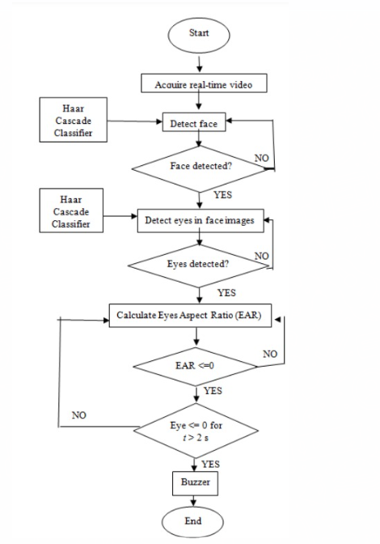

# Drowsiness-Detector-Accident-Prevention

## Video acquisition: 
Video acquisition mainly involves obtaining the live video feed of the automobile driver. Video acquisition is achieved, by making use of a camera.
## Dividing into frames: 
This module is used to take live video as its input and convert it into a series of frames/ images, which are then processed.
## Face detection: 
The face detection function takes one frame at a time from the frames provided by the frame grabber, and in each and every frame it tries to detect the face of the automobile driver. This is achieved by making use of a set of pre-defined Haarcascade samples.
## Eyes detection: 
Once the face detection function has detected the face of the automobile driver, the eyes detection function tries to detect the automobile driver's eyes. This is achieved by making use of a set of pre-defined Haarcascade samples.
## Drowsiness detection: 
After detecting the eyes of the automobile driver , the drowsinessdetection function detects if the automobile driver is drowsy or not , by taking into consideration the state of the eyes , that is , open or closed and the blink rate.

